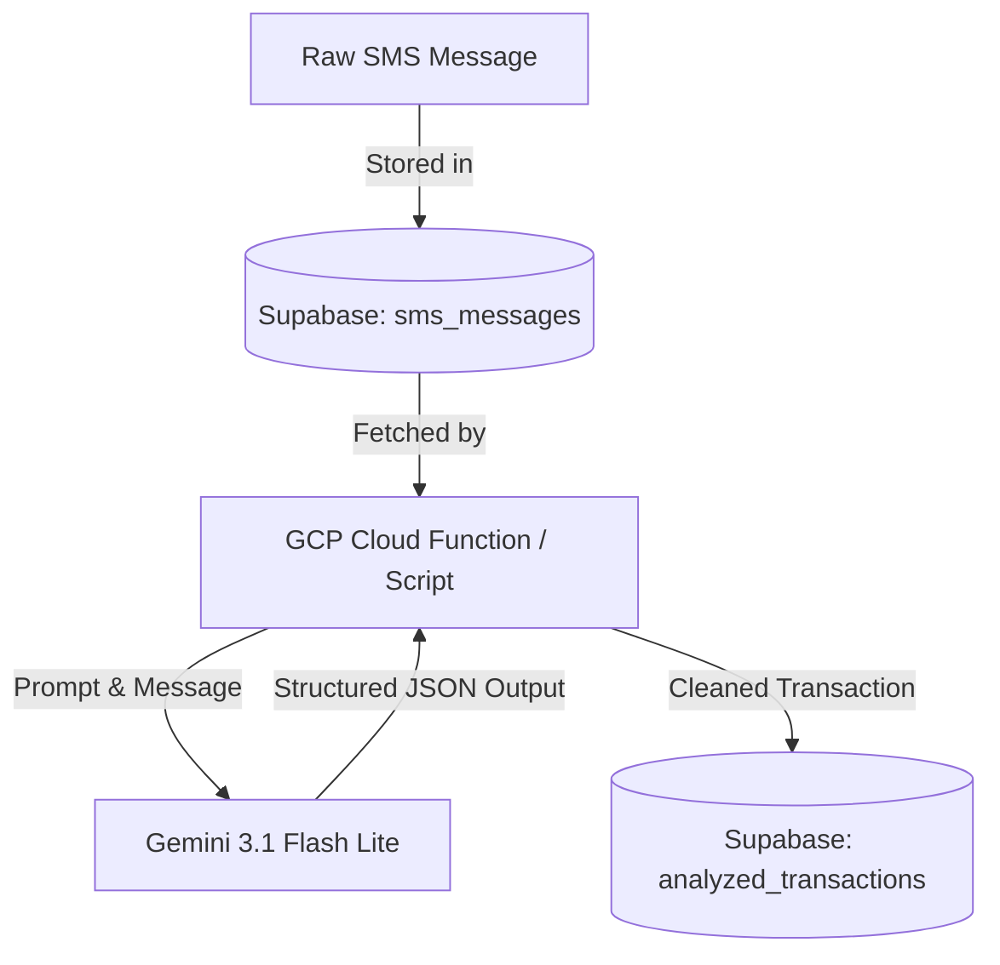

# GCP Function Context: SMS Transaction Cleaner & Analyzer

This repository contains a serverless pipeline designed to fetch, clean, and structure raw SMS message data into parsed transaction records. It integrates **Google Cloud Functions**, **Google Gemini AI**, and **Supabase (PostgreSQL)**.

---

## 1. System Architecture

The workflow consists of raw SMS messages being stored in a database, analyzed using an LLM, and structured into a transactions table:



### Key Components:
1. **`main.py`**: An HTTP Cloud Function entrypoint (`analyze_spending`) meant to process individual SMS messages on demand (e.g., triggered by database webhooks or Cloud Tasks).
2. **`cloud_tasks_publisher.py`**: A robust, production-hardened utility script designed to fetch rows directly from the database and execute the cleaning pipeline with comprehensive safety guards, retry loops, and fault tolerance.

---

## 2. Database Schema

Both tables reside in Supabase (PostgreSQL). The `analyzed_transactions` table references `sms_messages` via a foreign key on the message ID.

### Source Table: `sms_messages`
Stores the raw SMS logs received by devices.
```sql
create table public.sms_messages (
  id uuid not null,
  sender text not null,
  message_body text not null,
  received_timestamp timestamp with time zone not null,
  device_name text null,
  created_at timestamp with time zone not null default now(),
  constraint sms_messages_pkey primary key (id)
) TABLESPACE pg_default;

-- Index for querying chronological history
create index IF not exists idx_sms_received_timestamp 
on public.sms_messages using btree (received_timestamp desc) TABLESPACE pg_default;
```

### Target Table: `analyzed_transactions`
Stores structured financial transaction records extracted from messages.
```sql
create table public.analyzed_transactions (
  msg_id uuid not null,
  amount numeric null,
  transaction_type text null,
  merchant text null,
  category text null,
  created_at timestamp with time zone not null default now(),
  constraint analyzed_transactions_pkey primary key (msg_id),
  constraint analyzed_transactions_msg_id_fkey 
    foreign KEY (msg_id) references sms_messages (id) on delete CASCADE
) TABLESPACE pg_default;
```

---

## 3. Data Extraction & LLM Schema

The cleaning logic is powered by **Google Gemini 3.1 Flash Lite** (`gemini-3.1-flash-lite`), utilizing structured outputs defined by the following **Pydantic** schema:

```python
class TransactionAnalysis(BaseModel):
    is_transaction: bool = Field(
        description="True if this message represents an actual financial transaction where money entered or left the account, False otherwise."
    )
    amount: Optional[float] = Field(
        None, 
        description="The transaction amount, or null if not a transaction."
    )
    transaction_type: Optional[str] = Field(
        None, 
        description="Must be 'DEBIT' (money leaving account) or 'CREDIT' (money entering account), or null."
    )
    merchant: Optional[str] = Field(
        None, 
        description="The merchant name, bank name, or person involved in the transaction, or null."
    )
    category: Optional[str] = Field(
        None, 
        description="Category of spend: Food, Utilities, Shopping, Travel, Entertainment, Transfer, Investment, Income, Other, or null."
    )
```

### Classification Rules (Prompt Logic)
* **Transaction (`is_transaction = True`)**: Actual movement of money into or out of the user's account. This includes: debits/credits, completed UPI transfers, card purchases, ATM withdrawals, and refunds.
* **Non-Transaction (`is_transaction = False`)**: OTP codes, failed/declined transactions, payment bill reminders, marketing/promotional offers, and general balance updates.

---

## 4. Production Robustness & Resiliency

To guarantee mission-critical reliability in production, the pipeline incorporates the following safeguards:

* **Rate Limit (HTTP 429) & Transient Error Retries**: 
  Automatic retries with exponential backoff are wrapped around Gemini API calls. It retries on HTTP `429` (rate limits) and transient server errors (HTTP `500`, `502`, `503`, `504`, timeouts, and connection losses).
* **Database Connection Retries**:
  Database operations (`select`, `upsert`) are wrapped in a retry wrapper to automatically handle database connection drops or network glitches.
* **Fail-Safe Crash Prevention**:
  The core pipeline function catches all exceptions internally and returns a status dict (`{"status": "failed", "error": "..."}`) rather than throwing unhandled exceptions. This prevents a single corrupt record from crashing a batch loop.
* **Strict Validation & Normalization**:
  * Inputs are strictly type-validated.
  * Message IDs are pre-validated to be valid UUIDs before database insertion.
  * Empty or whitespace-only messages bypass LLM calls entirely to conserve API quota.
  * Extracted values (e.g. `transaction_type`) are normalized (uppercased) prior to database insertion.

---

## 5. Setup & Local Development

### Configuration
Configure a local `.env` file in the project root:
```env
SUPABASE_URL="https://your-project.supabase.co"
SUPABASE_KEY="your-supabase-service-role-or-anon-key"
GEMINI_API_KEY="your-gemini-api-key"
GEMINI_MODEL="gemini-3.1-flash-lite"
```

### Local Functions Framework (HTTP Server)
To run and test the Cloud Function endpoint locally:
```bash
pip install -r requirements.txt
functions-framework --target=analyze_spending --debug
```
Trigger the endpoint using `POST` with JSON payload:
```json
{
  "id": "e2a3c2cf-4b71-460d-83b6-96a8c7b80c33",
  "sender": "HDFC-BANK",
  "message_body": "Alert: Rs. 1500.00 spent on HDFC Card at Amazon."
}
```

### Local Pipeline Runner
To fetch a live row from Supabase and run the cleaning logic locally:
```bash
python cloud_tasks_publisher.py
```

---

## 6. Deployment to GCP Cloud Functions

Deploy the function to Google Cloud Functions via the Google Cloud CLI (`gcloud`):

```bash
gcloud functions deploy analyze-spending \
  --runtime=python310 \
  --trigger-http \
  --allow-unauthenticated \
  --entry-point=analyze_spending \
  --set-env-vars SUPABASE_URL="your-supabase-url",SUPABASE_KEY="your-supabase-key",GEMINI_API_KEY="your-gemini-api-key"
```

> [!IMPORTANT]
> For production environments, it is recommended to store credentials securely using **Google Secret Manager** and mount them as environment variables, instead of passing them as plain-text parameters in the deployment command.
